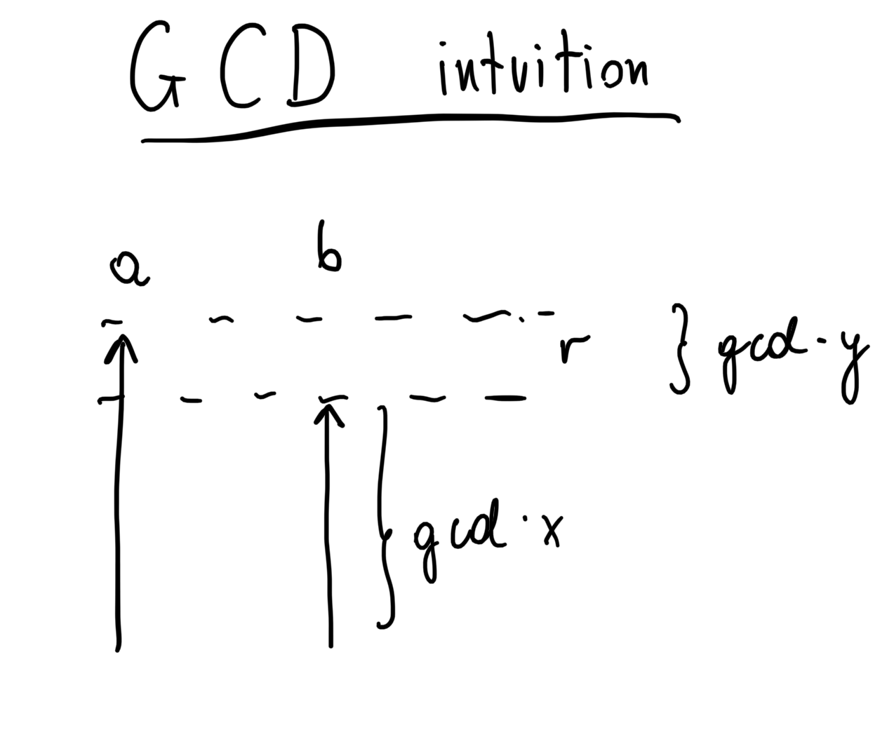
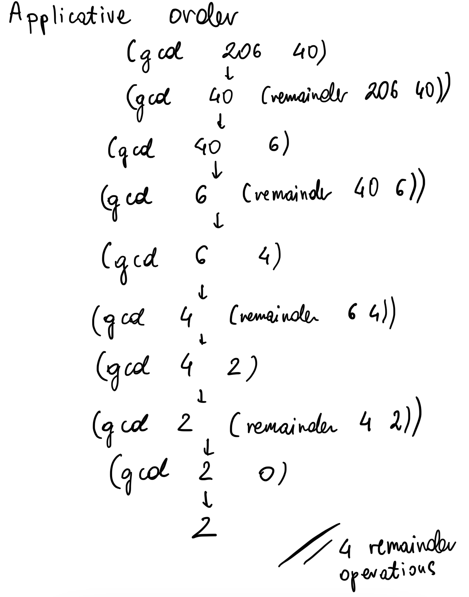
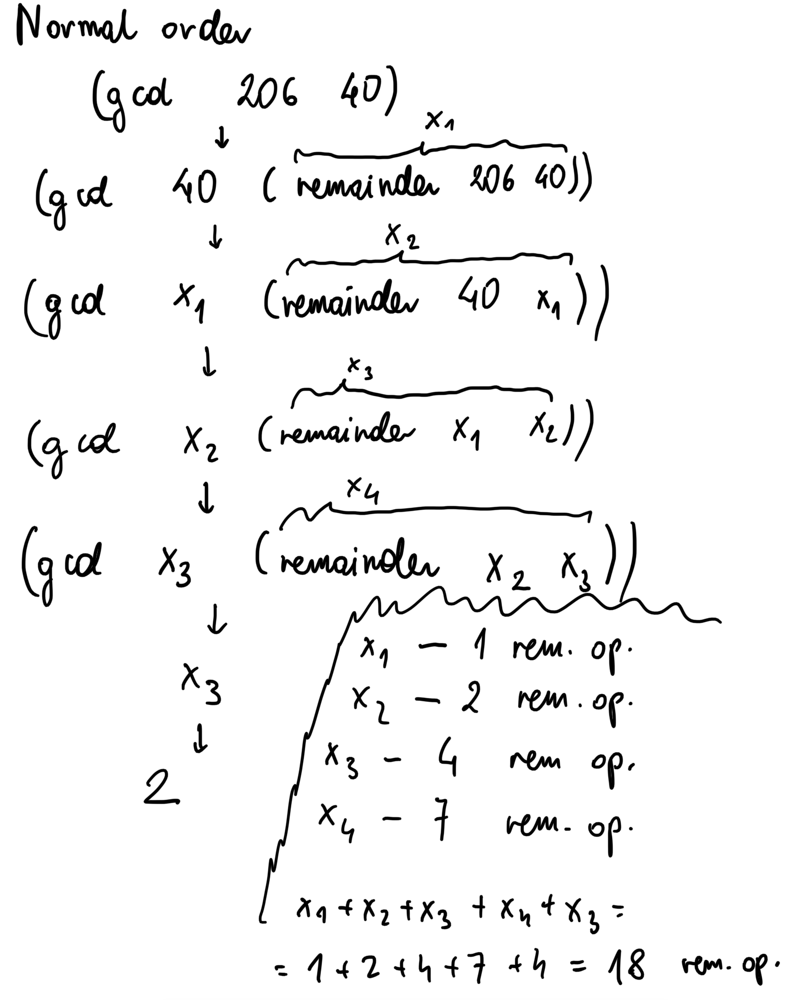

# SICP notes
These are my notes for the [Structure and Implementation of Computer Programs](https://mitpress.mit.edu/sites/default/files/sicp/full-text/book/book.html) text book.

## Applicative order vs normal order
Applicative order - evaluate the arguments and then apply.
```
(square (+ 5 1)) -> (square 6) -> (* 6 6) -> 36
```

Normal order - fully expand and then reduce.
```
(square (+ 5 1)) -> (* (+ 5 1) (+ 5 1)) -> (* 6 6) -> 36
```

Lisp uses applicative order evaluation.
This is why `if` and `cond` have to be special forms (see Exercise 1.6.).

## Conditional expressions
```
(cond (<p1> <e1>)
      (<p2> <e2>))

(cond (<p1> <e1>)
      (else <e2>))

(if <predicate> <consequent> <alternative>)
```

In an if expression, the consequent and alternative must be single expressions.

## Recursion and iteration
Recursive process is characterized by a chain of deferred operations. Carrying out this process requires the interpreter to keep track of the operations to be performed later on.
Recursive process grows and then shrinks.

Iterative process does not grow and shrink. Iterative process can be characterized by a fixed number of state variables and a fixed rule describing how the state variables should be updated as the process moves from state to state. Iterative process can be executed using constant space.

Recursive procedure definition refers to itself. A recursive procedure does not have to describe a recursive process - it can describe an iterative process.

Most implementations of common languages are designed in such a way that the interpretation of any recursive procedure consumes an amount of memory that grows with the number of procedure calls, even when the process described is iterative! Therefore, in those languages (e.g. C) iterative processes can only be described using loops.

Tail-recursive property holds when iterative process described by recursive procedure is executed in constant space. With tail-recursive implementation, iteration can be expressed using ordinary procedure call mechanism.

### Exercise 1. 11.
>A function f if defined by the rule that f(n) = n if n < 3 and f(n) = f(n-1) + 2f(n-2) + 3f(n-3) if n >= 3. Write a procedure that computes f by means of a recursive process. Write a procedure that computes f by means of an iterative process.

Writing a procedure that computes f by means of a recursive process is quite natural:
```
(define (frec n)
      (if (< n 3)
            n 
            (+
                  (frec (- n 1))
                  (* 2 (frec (- n 2)))
                  (* 3 (frec (- n 3)))
            )
      )
)
```

What is the intuiton behind computing f by means of an iterative process? So, to compute f(n), we need f(n-1), f(n-2) and f(n-3). Looking the other way around, if we have f(n-1), f(n-2) and f(n-3) we can compute f(n). Then, we can compute f(n+1) because we have f(n), f(n-1) and f(n-2) and we no longer need f(n-3). So, we need 3 state variables and a rule to update them. Let's start by what we know and assign:
```
a <- f(2) = 2
b <- f(1) = 1
c <- f(0) = 0
```

Next, we can update them according to the intuiton above:
```
a <- a + 2b + 3c = f(2) + 2f(1) + 3f(0) = f(3)
b <- a = f(2)
c <- b = f(1)
```

Continuing this procedure, we can see that after n steps c = f(n). This is kind of like memoization/dynamic programming, as we only keep the values that we know we will need. Translating to Scheme:
```
(define (fiter-helper a b c count)
      (if (= count 0)
            c
            (fiter-helper (+ a (* 2 b) (* 3 c)) a b (- count 1))
      )
)

(define (fiter n)
      (fiter-helper 2 1 0 n)
)
```

### Exercise 1. 16.
>Design a procedure that evolves an iterative exponentiation process that uses successive squaring and uses logarithmic number of steps.

Using the observation that 
```
b^n = b^(n/2)^2 = b^2^(n/2)
```
and suggestion to use an additional state variable a so that ab^n is constant:
```
(define (fast-expt-inner b n a)
    (cond ((= n 0) a)
          ((even? n) (fast-expt-inner (* b b) (/ n 2) a))
          (else (fast-expt-inner b (- n 1) (* a b)))
    )
)

(define (fast-expt-iter b n) (fast-expt-inner b n 1))
```
It is a nice suggestion to define an invariant quality that remains unchanged from state to state - it is a powerful way to think about the design of iterative algorithms.

## Greatest common divisors (GCD)
The GCD of two integers *a* and *b* is the largest integer that divides both *a* and *b* with no remainder.

We can implement an efficient algorithm for computing *GCD(a,b)* based on the observation that, if *r* is the remainder of *a* divided by *b*, then the common divisors are exactly the same as the common divisors of *b* and *r*. Therefore, we can use the equation:
```
GCD(a, b) = GCD(b, r) ; where r := a mod b
```
Applying this reduction repeatedly will finally yield a pair where the second number is 0. The GCD of any number *a* and 0 is *a* itself.

So using the above observation we can implement the algorithm:
```
(define (gcd a b)
      (if (= b 0)
          a
          (gcd b (remainder a b))
      )
)
```
Using Lame's theorem it can be shown that the order of growth for the above algorithm is *O(log n)* where *n* is smaller of the two nubmers *a* and *b*.

So what is the intuiton for the observation that:
```
GCD(a, b) = GCD(b, r)
```
?

Hopefully, this image provides some help:

Greatest common divisor *gcd* has to divide *b* evenly. So, we can express *b* as *gcd times x*; *gcd* also has to divide *a* evenly. We can express *a* as *gcd times x + gcd times y*; *gcd times y* is equal to *r* (*x* and *y* are arbitrary numbers). Hence, the problem comes down to finding the greatest common divisor of *b* and *r*.

It is easy to convince oneself, that repeating this procedure repeatedly can only make the *b* parameter smaller and it will eventually become 0.

### Exercise 1. 20.
>How many `remainder` operations are actually performed in the normal-order evaluation of `(gcd 206 40)`? In the applicative-order evaluation?

It is easy to go through the procedure using the applicative-order evaluation and determine that it requires just *4* `remainder` operations:


Using normal-order evaluation:

with every call, the second argument has to be evaluated as it is used in the `if` statement's predicate. 

*x1* requires *1* `remainder` operation.

*x2* requires *2* `remainder` operations - *1* for *x1* and *1* for itself.

*x3* requires *4* `remainder` operations - *1* for *x1*; *2* for *x2* and *1* for itself.

*x4* requires *7* `remainder` operations - *2* for *x2*; *4* for *x3* and *1* for itself.

Finally, *x4* evaluates to *0* and expression is reduced to *x3* which again requires *4* `remainder` operations. Summing all the required evaluations up we end up with *18* evaluations.

So, in this case applicative-order evaluation is better.

## Formulating abstractions
>We have seen that procedures are, in effect, abstractions that describe compound operations on numbers independent of the particular numbers. For example, when we
>
> `(define (cube x) (* x x x))`
> 
>we are not talking about the cube of a particular number but rather about a method for obtaining the cube of any number. Of course, we could get along without ever defining this procedure, by always writing expressions such as:
>
> `(* 3 3 3)`
>
> `(* x x x)`
>
>and never mentioning `cube` explicitly. This would place us at a serious disadvantage, forcing us to work always at the level of the particular operations that happen to be primitives in the language (multiplication, in this case) rather than in terms of higher-level operations. *Our programs would be able to compute cubes, but our language would lack the ability to express the concept of cubing*. One of the things we should demand from a powerful programming language is the ability to build abstractions by assigning names to common patterns and then to work in terms of the abstractions directly. Procedures provide this ability. This is why all but the most primitive programming languages include mechanisms for defining procedures. 
>
>Yet even in numerical processing we will be severely limited in our ability to create abstractions if we are restricted to procedures whose parameters must be numbers. Often the same programming pattern will be used with a number of different procedures. To express such patterns as concepts, we will need to construct procedures that can accept procedures as arguments or return procedures as values. Procedures that manipulate procedures are called higher-order procedures.

## Lambda
`(lambda (<formal-parameters>) <body>)`

### Using `let` to create local variables
`let` is syntactic sugar for application of `lambda`

Example:

f(x,y) = x(1+xy)^2 + y(1-y) + (1+xy)(1-y)

could be expressed as:

f(x, y) = xa^2 + yb + ab; where a = 1 + xy and b = 1 - y

Translating to Scheme we can bind those local variables *a* and *b* using another inner procedure:
```
(define (f x y)
      (define (f-helper a b)
            (+ (* x (square a))
               (* y b)
               (* a b)
            )
      )
      (f-helper (+ 1 (* x y)) (- 1 y))
)
```

This can also be expressed using `lambda`:
```
(define (f x y)
      (
            (lambda (a b)
                  (+ (* x (square a))
                     (* y b)
                     (* a b)
                  )
            )
      )(
            (+ 1 (* x y))
            (- 1 y)
      )
)
```

There is a special form called `let` that makes it more convenient:
```
(define (f x y)
      (let (
            (a (+ 1 (* x y)))
            (b (- 1 y))
      ) 
            ( + (* x (square a ))
                (* y b)
                (* a b)
            )
      )
)
```

Its general form is:
```
(let (
      (<var1> <exp1>)
      (<var2> <exp2>)
)
      <body>
)
```

It is preferred to use `let` to define local variables instead of `define`. It is better to use `define` for internal procedures only.

## Building Abstractions with Data
>Data abstraction is a methodology that enables us to isolate how a compound data object is used from the details of how it is constructed from more primitive data objects.
>
>The basic idea of data abstraction is to structure the programs that are to use compound data objects so that they operate on abstract data.

This methodology enables us to make use of abstraction barriers. This is done by building programs that make use only of the public methods provided by the abstraction from the "lower layer". This makes programs easier to maintain and modify. There is no need to worry about the details of how the underlying methods are implemented. In addition, underlying methods implementation can be changed and as long as the signatures and behaviour of public methods remain unchanged, previously written programs should work just fine.

>What is meant by data?
> In general, we can think of data as defined by some collection of selectors and constructors, together with specified conditions that these procedures must fulfill in order to be a valid representation.

### Exercise 2.4. - procedural representation of pairs
```
(define (cons x y)
      (lambda (m) (m x y))
)

(define (car z)
      (z (lambda (p q) p))
)

(define (cdr z)
      (z (lambda (p q) q))
)
```
A hand-wavy description of this exercise: cons takes in two arguments and returns a function that takes in another function as a parameter and applies it to the two arguments passed to cons. So, to get the first argument, car calls the function returned by cons with a function that just returns the first parameter. Cdr's implementation is analogous.
